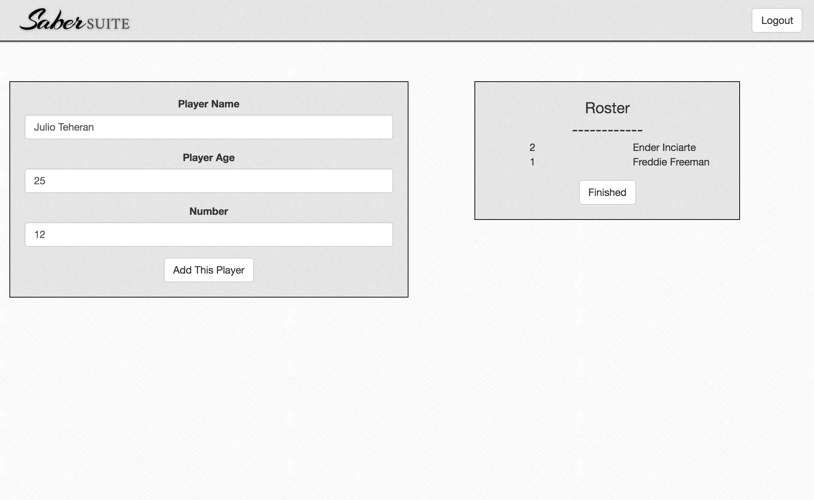

#Saber Suite
##Difficult Metrics Done the Easy Way

##Overview of Project

##Technologies, Frameworks, and Programming Languages used
* HTML & CSS
* JavaScript
* AngularJS
* Bootstrap 3
* Node.js
* Express.js
* PostgreSQL
* PG-Promise

##Creator
* [Cody Barber](https://github.com/codybarber)

##Project Screenshots

Saber Suite Sign In Page

Saber Suite's User Dashboard

Adding Players to a Created Team

Entering a Player's Offensive Stats

Displaying a Player's Stats

##URL to live project

[Check it out!]()
